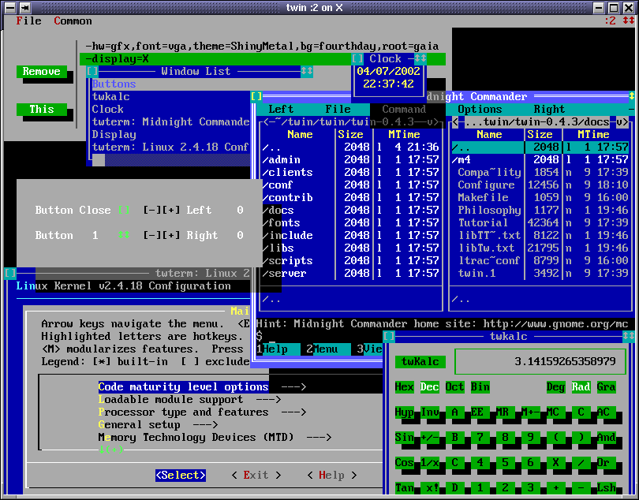

--------------------------------------------------------------
Nemesis (fork of Twin) - a Textmode WINdow environment
--------------------------------------------------------------

This tree is a Nemesis fork of Twin. The upstream README continues below;
this section documents what differs.

### WM side-channel socket (phase 4A)

The forked `twin_server` exposes a second Unix domain socket alongside the
libtw socket, intended for an external window manager:

* path: `<TmpDir>/.Twin<TWDISPLAY>-wm` (e.g. `/tmp/.Twin:0-wm`)
* mode 0600, FD_CLOEXEC, listen backlog 1 (one WM at a time)
* wire format: line-framed JSON, one event per line

Phase-4A events emitted: `{"type":"map","wid":...,"screen":...,"x":..,"y":..,"w":..,"h":..}`
on every window map. The built-in WM remains authoritative; the attached
external process is observer-only until further phases land.

### Running from the build tree

`twin_server` looks for plugins under `--plugindir` (default
`/usr/local/lib/twin`). To run without installing, stage the in-tree plugins
in one directory and point `--plugindir` at it:

```
mkdir -p /tmp/twin-plugins
ln -sf $PWD/server/.libs/libsocket-1.0.0.so       /tmp/twin-plugins/
ln -sf $PWD/server/.libs/librcparse-1.0.0.so      /tmp/twin-plugins/
ln -sf $PWD/server/hw/.libs/libhw_x11-1.0.0.so    /tmp/twin-plugins/
ln -sf $PWD/server/hw/.libs/libhw_display-1.0.0.so /tmp/twin-plugins/
ln -sf $PWD/server/hw/.libs/libhw_tty-1.0.0.so    /tmp/twin-plugins/
ln -sf $PWD/server/hw/.libs/libhw_twin-1.0.0.so   /tmp/twin-plugins/

DISPLAY=:0 ./server/twin_server --hw=X --plugindir=/tmp/twin-plugins
```

Unlike upstream, `InitWM` loads the libtw socket module unconditionally, so
clients such as `twclutter`, `twterm`, and `twattach` can connect with any
`--hw=...`, not just `--nohw`.

--------------------------------------------------------------
Twin - a Textmode WINdow environment (upstream)
--------------------------------------------------------------

Version 0.9.1

Twin is text-based windowing environment with mouse support, window manager,
truecolor terminal emulator, networked clients and the ability to attach/detach
mode displays on-the-fly.

It supports a variety of displays:
* plain text terminals: Linux console, twin's own terminal emulator,
  and any termcap/ncurses compatible terminal;
* X11, where it can be used as a multi-window xterm;
* itself (you can display a twin on another twin);
* twdisplay, a general network-transparent display client, used
  to attach/detach more displays on-the-fly.

Currently, twin is tested on Linux (i386, x86_64, arm, arm64, PowerPC, Alpha, Sparc),
on macOS (x86_64, arm64), on FreeBSD (i386, x86_64) and on Android (arm64 both on termux and UserLand).
I had yet no chance to seriously test it on other systems.

The following screenshot shows an example of twin with various clients:



Documentation
--------------------------------------------------------------

[COPYING](COPYING)
	License: twin server and clients are GPL'ed software.

[COPYING.LIB](COPYING.LIB)
	Library license: the libraries libtutf, libtw
	are LGPL'ed software.

[INSTALL](INSTALL)
	Quick compile/install guide.

[twinrc](twinrc)
	A detailed example of ~/.config/twin/twinrc look-n-feel configuration file.

Upstream twin shipped a Tutorial, FAQ, Configure, libtw API reference,
and porting notes under `docs/`. They were removed in the nemesis fork;
the upstream copies live at https://github.com/cosmos72/twin if needed.

--------------------------------------------------------------
Getting twin


Since you are reading this README, you probably already have it,
anyway twin can be downloaded from

https://github.com/cosmos72/twin

--------------------------------------------------------------
Building and installing twin

For the impatient, it basically reduces to
```
  ./configure
  make
```
then run as root
```
  make install
```
on Linux, also remember to run as root:
```
  ldconfig
```
on FreeBSD instead, remember to run as root:
```
  ldconfig -R
```

To compile twin you need the following programs installed
on your system:

  * a Bourne-shell or compatible (for example bash, dash, ash...)

  * make (most variants are supported: GNU make, BSD make...)

  * an ANSI C compiler (for example gcc or clang)

  * a C++ 98 compiler (for example g++ or clang++)


Note: it is STRONGLY recommended to install at least the following packages before compiling twin
(the exact names depend on the operating system or Linux distribution):

  * x11-dev      - may be named x11-devel, libx11-dev ...
  * xft-dev      - may be named xft-devel, libxft-dev ...
  * ncurses-dev  - may be named ncurses-devel, libncurses-dev ...
  * zlib-dev     - may be named zlib1g-dev, zlib-devel, libzlib-dev ...

On Linux, it is STRONGLY recommended to also install the following package before compiling twin:

  * gpm-dev      - may be named gpm-devel, libgpm-dev ...

-- WARNING: if you manually enable options that were disabled by `./configure',
build will almost certainly fail! --


Greetings,

Massimiliano Ghilardi
